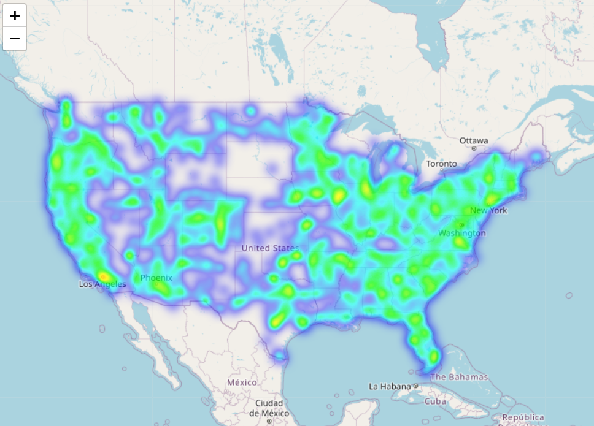
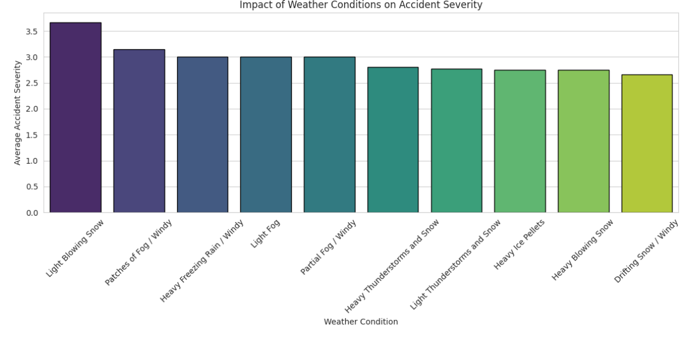
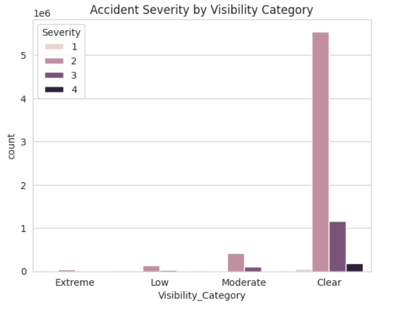

# US Accident Data Analysis


---

## Project Overview
Traffic accidents are a major public safety concern.  
This project performs **Exploratory Data Analysis (EDA)** on the US Accidents dataset to understand patterns in traffic accidents across the United States.

The analysis explores accident trends based on:
- Geographic distribution
- Time patterns
- Weather conditions
- Visibility conditions

The goal is to identify factors that contribute to accident frequency and severity.

---

## Tools Used
- Python  
- Pandas  
- NumPy  
- Matplotlib  
- Seaborn  
- Plotly  
- Folium  
- Jupyter Notebook  

---


## Project Structure

```
us-accident-data-analysis
│
├── data    # Dataset location (empty, Kaggle link provided)
│
├── images  # Important saved visualizations
│
├── notebooks
│   └── accident_analysis.ipynb
│
└── requirements.txt   # Python dependencies
```


## Dataset
The dataset used in this project is the **US Accidents Dataset**.  
Due to its large size, the dataset is not included in this repository.  

You can download it from Kaggle:  
[US Accidents Dataset](https://www.kaggle.com/datasets/sobhanmoosavi/us-accidents)

---

## Visualization Examples

### Accidents by Hour
.png)

### Top 10 Accident-Prone Cities


### Top 10 Accident-Prone States


### Accident Heatmap


### Weather Conditions


### Visibility Impact



---

## Key Insights
- Most accidents occur during rush hours .  
- Weather conditions like rain and fog increase accident frequency.  
- Certain states and cities show significantly higher accident counts.  
- Urban areas report more accidents than rural areas.  
- Visibility plays a major role in accident severity.  
- Accident trends vary across weekdays and months.  

---

## Installation

Clone the repository:
```bash
git clone https://github.com/yourusername/us-accident-data-analysis.git

---

## Future Improvements

- Build a machine learning model to predict accident severity
- Create an interactive dashboard for accident analysis
